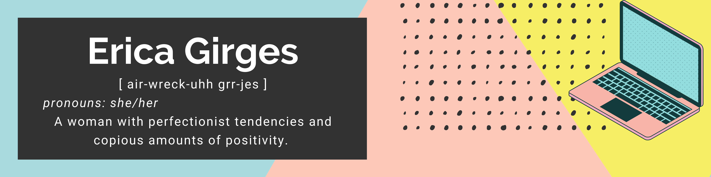

## About Me 👋
I'm Erica Girges and welcome to my Github profile! I'm a full-stack engineer and love helping others. With both of these skill sets and passions, I've found my happy place to be in Dev Advocacy. 😊 

I also love exploring new things in tech and sharing my experiences with them. My shine comes through in making relatable and easy to understand tech content. 

## Tech Stack 👩‍💻
- Javascript
- Typescript
- React
- Next.JS
- Redux
- Context
- Styled Components
- Tailwind CSS
- Node.JS
- HTML
- CSS
- PostgreSQL
- SQLite3
- MongoDB
- Mongoose
- SQL
- Vercel
- Heroku

## Interested in 💡
- Frontend
- Backend
- Creative tech or projects! 🌼

## Contact
Email: ericafiorenza@gmail.com
LinkedIn: https://www.linkedin.com/in/ericagirges/

